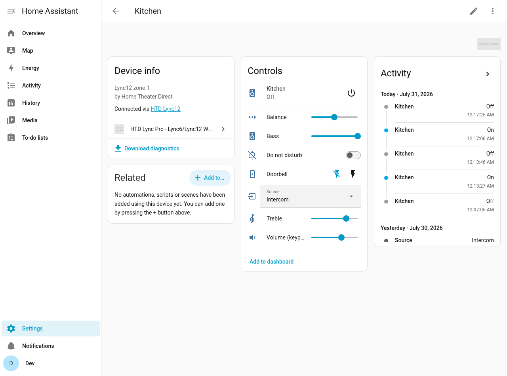
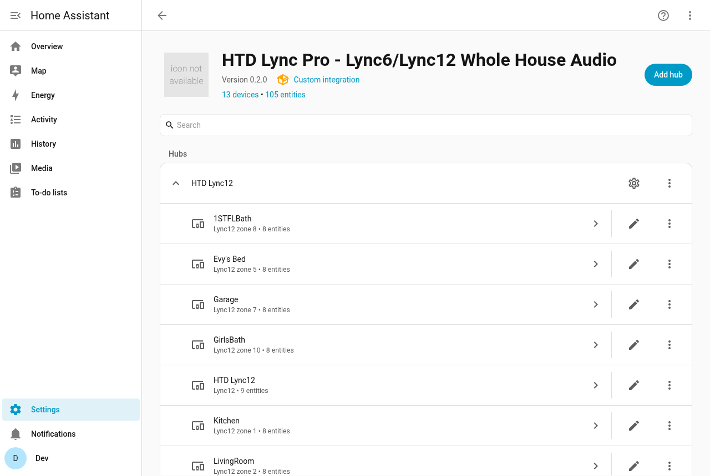
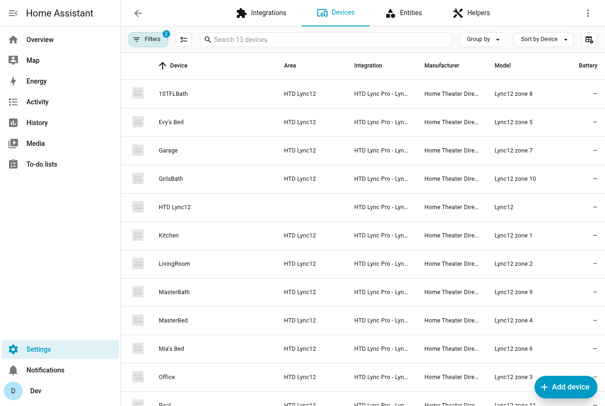

<picture>
  <source media="(prefers-color-scheme: dark)" srcset="brand/dark_logo.png">
  
</picture>

# HTD Lync Pro — Lync6/Lync12 Whole House Audio for Home Assistant

Full-control Home Assistant integration for the **HTD Lync 6 / Lync 12**
whole-house audio controllers. Everything the official HTD app can do —
plus several things it can't.

## Highlights

- **Per-zone media player** — power, volume (keypad 0-60 / dB), mute, and
  source selection using the **real zone and source names stored in the unit**
- **Doorbell ring detection** 🔔 — a binary sensor + HA event fire the
  instant the doorbell is pressed (undocumented protocol message,
  discovered by reverse engineering; exists in no other integration)
- **Automatic post-doorbell restore** — the chime hijacks zones to the
  Intercom source and leaves them there; this integration snapshots every
  zone when the ring starts and puts power/source/volume back exactly how
  they were when the chime ends
- **Party scenes** — one service call turns on a set of zones, puts them on
  one source, and sets a base volume with per-zone offsets
- **Tone controls** — bass, treble, balance sliders per zone
- **Inline source dropdown** per zone (`select` entity) — switch sources
  right from the device page or a dashboard, no dialogs
- **DND + Doorbell-enable switches** per zone
- **Whole house** — all-zones on/off buttons, hardware party mode,
  hardware presets 1–4 (recall buttons + save service)
- **Built-in MP3 player** — transport controls, repeat, file & artist name
- Rename zones and sources **on the unit itself** from HA
- **GW-SL1 network gateway (TCP)** or **direct RS-232 serial** connection
- **Local push** — keypad changes appear in HA immediately; optional
  polling and manual refresh available

## Screenshots

Zone device page — every control in one place (media player, tone
sliders, DND/doorbell switches, inline source dropdown, diagnostics):



The integration with its 12 zone devices, named straight from the unit:



<details>
<summary>Devices list</summary>



</details>

## Installation

### HACS

HACS requires the repository to be hosted on GitHub — add the GitHub mirror
as a custom repository (type: Integration), install **HTD Lync Pro**, and
restart Home Assistant.

### Manual

Copy `custom_components/htd_lync_pro` into `config/custom_components/` and
restart Home Assistant.

## Configuration

Settings → Devices & Services → **Add Integration** → search "htd", "lync",
"lync6" or "lync12" → **HTD Lync Pro**.

| Connection | Settings |
|---|---|
| Network gateway (GW-SL1 / WGW-SL1) | Gateway IP, port `10006` (default) |
| Direct RS-232 | Device path e.g. `/dev/ttyUSB0` (38400 8N1) |

Give the GW-SL1 a **DHCP reservation** in your router. If its IP ever
changes: integration entry → **⋮ → Reconfigure** (keeps all entities and
automations intact — never delete/re-add).

### Options (integration entry → Configure)

| Option | Default | Meaning |
|---|---|---|
| Polling interval | `0` | `0` = push only; `N` seconds adds periodic full polls. Manual refresh always available via the Refresh button or `htd_lync_pro.refresh`. |
| Doorbell restore | on | Restore zone power/source/volume automatically after the doorbell chime ends. |
| Max power-on volume | `0` | If set (keypad 0-60), a zone turning on louder than this gets clamped — no more 2 AM blasts from a remembered volume. |
| Quiet-hours volume / start / end | `0`, 22:00–07:00 | A tighter power-on cap during the quiet window. |
| Announcement player / TTS entity | — | Defaults for `htd_lync_pro.announce` (e.g. a Raspberry Pi VLC feeding the amps' override RCA input, and your TTS engine). |
| Tone encoding | `signed` | Leave on `signed` (verified on firmware v3). `offset` only for unverified older firmware following HTD's v1.1 PDF. |

## Entities

Each zone is its own HA device, named with the zone name stored in the unit:

| Entity | Purpose |
|---|---|
| `media_player.<zone>` | Power, volume, mute, source; attributes expose dB, keypad volume, bass/treble/balance, DND, party flag, raw status bytes |
| `select.<zone>_source` | Inline source dropdown (note: selecting a source powers the zone on — hardware behavior) |
| `number.<zone>_bass` / `_treble` | −10…+10 |
| `number.<zone>_balance` | −18 (left) … +18 (right) |
| `number.<zone>_volume_keypad_0_60` | Volume on the keypad scale |
| `switch.<zone>_do_not_disturb` | Zone ignores party mode & doorbell |
| `switch.<zone>_doorbell` | Doorbell chime enabled for this zone (optimistic — the unit doesn't report it) |

On the controller device:

| Entity | Purpose |
|---|---|
| `binary_sensor.<name>_doorbell_ringing` | On for exactly the chime duration; `doorbell_input` attribute says which doorbell terminal (1/2) |
| `media_player.<name>_mp3_player` | Built-in MP3 player: play/pause, stop, next/prev, repeat, file & artist |
| `button.<name>_all_zones_on` / `_off` | Whole-house power |
| `button.<name>_recall_preset_1…4` | Hardware presets stored in the unit |
| `button.<name>_refresh` | Manual full poll |

## Doorbell automations

When the doorbell is pressed the unit emits an undocumented serial message;
the integration turns it into:

- `binary_sensor.*_doorbell_ringing` → `on` for the chime duration
- Event **`htd_lync_pro_doorbell`** with `doorbell_input` (1 or 2)

```yaml
automation:
  - alias: "Doorbell → front camera on the TV"
    trigger:
      - platform: event
        event_type: htd_lync_pro_doorbell
    action:
      - action: camera.play_stream
        target: { entity_id: camera.front_door }
        data: { media_player: media_player.living_room_tv }
```

Zones with **DND on or Doorbell off do not get interrupted** by the chime.
Everything the chime does change is automatically reverted a couple of
seconds after it ends (see Options to disable).

## Party scenes with `htd_lync_pro.set_zones`

```yaml
script:
  pool_party:
    alias: "Pool party"
    sequence:
      - action: htd_lync_pro.set_zones
        data:
          zones: [3, 4, 5, 6, 8]   # zone numbers
          source: "Sonos"          # source name or number
          volume: 30               # base keypad volume (0-60)
          offsets:
            "3": 10                # pool louder
            "6": -8                # bathroom quieter
          others_off: true         # power off every other zone
```

## Services

| Service | Purpose |
|---|---|
| `htd_lync_pro.set_zones` | Party scene: zones + source + base volume + per-zone offsets |
| `htd_lync_pro.party_mode` | Hardware party mode: every zone follows one source |
| `htd_lync_pro.all_on` / `all_off` | Whole-house power |
| `htd_lync_pro.recall_preset` / `save_preset` | Hardware presets 1–4 |
| `htd_lync_pro.set_zone_name` / `set_source_name` | Rename on the unit itself (max 10 chars) |
| `htd_lync_pro.refresh` | Manual full poll |
| `htd_lync_pro.snapshot` / `restore` | Save all zone states / put them back (only changed zones get commands) — bracket movie night, announcements, experiments. The snapshot lives in memory and does not survive a Home Assistant restart. |
| `htd_lync_pro.follow_me` | Move the playing music to another zone (`to_zone`, optional `from_zone`, `exclude_zones`, `turn_off_source`, `copy_volume`, `volume_offset`). If several zones are playing and no `from_zone` is given, the lowest-numbered one is used and a warning is logged. |
| `htd_lync_pro.announce` | TTS message or media URL through the announcement player at a set volume, restoring the previous volume afterwards |

### Events

| Event | Data | Fired |
|---|---|---|
| `htd_lync_pro_doorbell` | `entry_id`, `doorbell_input` (1/2 bitmask) | Once per doorbell press, at chime start |

## Follow-me audio

Music follows you around the house using your motion/presence sensors.
Import the blueprint (Settings → Automations & Scenes → Blueprints →
Import Blueprint) using the raw URL of
[`blueprints/follow_me.yaml`](blueprints/follow_me.yaml) from this
repository, then create one automation per room: pick the room's motion
sensor and zone number. Fully configurable per room: excluded zones
(kids' rooms stay quiet), volume copy/offset, whether the room you left
turns off, and an active time window.

Tuning tips: use generous motion-sensor timeouts and keep
`turn_off_source` on — short timeouts can strand the music in a hallway
you only walked through. The service is a no-op when nothing is playing,
so the automations are safe to leave enabled.

## Announcements

With amps that have an auto-ducking override RCA input (fed by e.g. a
Raspberry Pi running VLC), announcements need no Lync source switching at
all — the amps duck automatically when audio plays:

```yaml
- action: htd_lync_pro.announce
  data:
    message: "Dinner is ready!"
    volume_level: 0.6        # announcement player volume, restored after
```

Set the announcement player and TTS engine once in the integration
options; `media_url` plays a file/stream instead of TTS.

## Dashboard

A ready-made whole-house view (zone rows + source dropdowns + party
buttons + doorbell status) is in [docs/dashboard.yaml](docs/dashboard.yaml).

## Troubleshooting

- **Debug logging** (logs every TX/RX byte):

  ```yaml
  logger:
    logs:
      custom_components.htd_lync_pro: debug
  ```

  Or at runtime without a restart: Developer Tools → Actions →
  `logger.set_level` with `custom_components.htd_lync_pro: debug`
  (runtime setting resets on restart).
- **Diagnostics**: integration entry → ⋮ → **Download diagnostics** —
  a JSON with model, firmware, options, and every zone's state (host
  redacted). Attach it to bug reports.
- **Zone shows "Zone N" instead of its name**: the unit hadn't answered
  the name query yet; names sync automatically within seconds. Manual
  device renames in HA always win over unit names.
- **Selecting a source turned the zone on**: hardware behavior, not a bug —
  the Lync powers a zone on for any source-select command.
- **"Lync reported: … range error"** in the log: the unit rejected a
  bass/treble/balance/volume value — check the tone-encoding option.
- **Volume moves on its own after the doorbell**: that's the doorbell
  restore putting zones back; disable it in Options if unwanted.

## Protocol notes

See [docs/PROTOCOL.md](docs/PROTOCOL.md) for the full wire protocol as
implemented, including several findings that appear in no HTD
documentation (the 0x1F doorbell message, chime behavior, the MP3/Intercom
sources, and the correct firmware-v3 encodings). Everything was verified
against a real Lync 12 (firmware v3), HTD's published hex codes, and the
decompiled official Android app.

## Development

- `tests/test_protocol.py` — protocol unit tests (`python3 tests/test_protocol.py`)
- `tools/lync_emulator.py` — a Lync 12 emulator for testing without
  hardware (`python3 tools/lync_emulator.py 10006`). Send common command
  `0xA2` to simulate a doorbell ring, including the real unit's
  zones-to-Intercom chime behavior.
- `brands/custom_integrations/htd_lync_pro/` — PR-ready assets for
  [home-assistant/brands](https://github.com/home-assistant/brands)
  (required for the integration icon to appear in the HA UI)

## License

[MIT](LICENSE)

## Credits

Built from the author's own
[Hubitat HTD Lync 12 driver](https://git.syfocloud.com/hubitat/htd-lync-12-whole-house-audio),
HTD's *Lync Serial Commands v1.1* and *Lync Hex Codes* documents, analysis
of the official HTD Lync Android app, and live captures from a Lync 12
(firmware v3).

## Trademarks and disclaimer

This is an **unofficial, independent** project, not affiliated with,
endorsed by, or supported by Home Theater Direct, Inc.

"HTD", "Home Theater Direct" and "Lync" are trademarks of their respective
owner and are used here only to identify the hardware this integration
works with (nominative use). No HTD logo or brand artwork is included in
this repository — the integration's icon is original artwork created for
this project. Protocol details were derived from HTD's publicly published
documentation and from observing traffic to hardware owned by the author.
